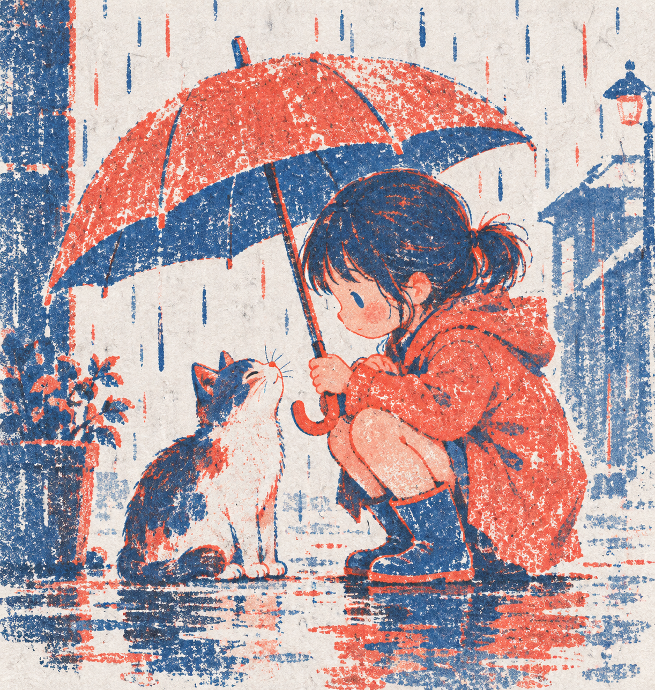

# Koi StyleKit

**简体中文** | [English](README.en.md) | [日本語](README.ja.md) | [한국어](README.ko.md) | [Español](README.es.md)

先看插画效果，再选画风、填主题，把配方留给下一次创作。

A local illustration style gallery, Python CLI, and agent skill sharing one prompt renderer. **Exports prompts; does not generate images.**

[v0.2.0-alpha 已发布](https://github.com/koi-lee/koi-stylekit/releases/tag/v0.2.0-alpha)。源代码已公开；下面是 AI 生成的候选样图，不能保证新主题或其他模型得到相同效果。

| 淡彩速写 | 双色孔版 | 彩铅日记 |
| --- | --- | --- |
|  |  |  |
| `emotional-sketch` | `duotone-print` | `colored-pencil-diary` |

文档提供中英文版本；当前网页界面与导出的风格配方仍以中文为主。

搜索引擎与 AI 阅读入口：[机器可读项目摘要](wireframes/llms.txt) · [爬虫规则](wireframes/robots.txt)。部署到正式域名后，请把 `robots.txt` 中的 Sitemap 地址替换为实际站点地址。


当前目录包含 **308 项配方，48 个风格家族与 260 个画法变体**。按媒介、家族或编号筛选；每项可预览样图、比较和导出。变体表示同一媒介下不同处理方式，样图不保证跨主题复现。

## 在线体验与静态部署

[打开在线画廊](https://www.starshoreai.com/koi-stylekit/gallery/)。正式 HTTPS 入口已通过浏览器验证，访客可直接浏览、填写主题、处理配色冲突、复制提示词与下载 JSON，无需下载仓库或安装 Python。网页界面和提示词仍以中文为主，五语文档不代表五语界面。

构建端需要 Python 3.10+ 与 Pillow；部署产物不需要 Python、Node 或后端接口：

```sh
python3 -m pip install -r requirements-build.txt
python3 scripts/build_static.py
python3 -m http.server 4321 --directory dist
```

最后一条命令仅用于本地验证。将 `dist/` 内全部内容部署到域名根目录或任意子目录即可；GitHub Pages 应发布构建产物并保留 `.nojekyll`。详见 [静态版交接与验证](docs/static-web.md)。

## 本地运行

## 五分钟开始

需要 Python 3.10+，无需安装第三方依赖。

```sh
git clone https://github.com/koi-lee/koi-stylekit.git
cd koi-stylekit
python3 scripts/serve.py
```

Windows 可将 `python3` 换成 `py -3`。也可从 GitHub 的 Code → Download ZIP 下载，解压后进入目录执行启动命令。

打开 [本地画廊](http://127.0.0.1:4317/)，按顺序体验：

1. 选择“双色孔版”，点击“填入示例主题”。
2. 点击预览；示例中的绿色书本会触发配色提醒。
3. 选择遵循风格，或保留主题颜色，再预览。
4. 复制提示词到你使用的生图工具，或下载 JSON 保存配方。
5. 点击“沿用风格”更换主题。

图片不会在网页中自动生成；保留主题颜色会得到未经生图验证的配色变体。

## 命令行

```sh
python3 scripts/koi.py list
python3 scripts/koi.py render --style colored-pencil-diary --subject '猫撑伞' --format text
python3 scripts/koi.py render --style duotone-print --subject '绿色的书' --color-policy subject
```

| 参数 | 用法 |
| --- | --- |
| `--purpose` | `single` 单场景（默认）、`explain` 三步讲解、`cover` 封面留字区 |
| `--aspect` | 可选 `1:1`、`3:4`、`16:9`；不传则不指定 |
| `--caption` | 独立标题，只进入 JSON，不要求图片模型绘制文字 |
| `--color-policy` | `ask`（默认）、`style` 遵循风格、`subject` 保留主题颜色 |
| `--format` | `json`（默认）或 `text` |

默认配色检测是保守的颜色词匹配，可能误报或漏报。需要选择时，JSON 返回 `status: needs_color_choice`、`prompt_zh: null`，退出码为 2。文本模式会显示提示，不输出矛盾配方。其他输入错误也使用退出码 2。

网页与 CLI 共用配方目录和 `render-rules.json`，以 `scripts/koi.py` 为行为基准并执行跨运行时对照测试，导出格式为 `koi-stylekit.v0.2`。旧 ID `minimal-line`、`ink-accent` 继续兼容，导出统一使用上表的新 ID。

## 在 Agent 中使用

让支持读取本地文件和运行命令的 Agent 阅读仓库根目录 [SKILL.md](SKILL.md)，例如：

> 读取这个仓库的 SKILL.md，用彩铅日记风格生成“猫在雨中撑伞”的提示词。

安装为宿主技能时须保留**完整仓库**，不能只复制 SKILL.md；自动发现目录按宿主说明设置。本项目不修改全局配置。已在本机 Codex 中验证安装与技能发现；其他宿主及模型行为尚未全面验证。

## 数据与限制

- 网页版主题只在浏览器内存中处理，不上传服务器；CLI 在本机处理；主动导出会保存到用户下载文件。
- “记住风格”仅在浏览器保存风格 ID。服务监听 `127.0.0.1`，不应作为公网服务器部署。
- 当前目录包含 308 项配方：48 个风格家族与 260 个画法变体，支持分类、家族筛选、编号搜索和分页；样图进度以页面标记为准；v0.2.0-alpha 标签仍为四种风格。单张样图认可不等于跨主题、跨模型稳定性验证。三步讲解与封面用途尚未完整生图验收。
- 不包含在线生图、英文配方、参考图输入、MCP、付费功能或自动社交发布。
- 主画廊全部使用本地样图；研究对照页含外部参考图链接。

## 常见问题

端口占用：运行 `python3 scripts/serve.py --port 4318`，然后访问对应端口。服务停止后可重新执行命令；网页保留的输入可再次预览。

请通过 HTTP/HTTPS 访问，不要直接双击 HTML。普通静态服务器已支持完整导出流程。复制权限不可用时会选中文本供手动复制，JSON 下载仍可使用。

## 验证与贡献

跨运行时对照测试另外需要 Node.js 22+；CLI 和网页使用者不需要 Node.js。

```sh
python3 -m unittest discover -s tests -v
```

本机隔离目录安装与 CLI/HTTP 一致性已验证。发布提交 `bbc76de` 的 [CI 六个任务](https://github.com/koi-lee/koi-stylekit/actions/runs/34359647023)通过（Windows/macOS/Ubuntu × Python 3.10/3.14）。

[贡献说明](CONTRIBUTING.md) · [当前状态与路线](docs/项目流程图.md) · [验收记录](docs/验收记录.md) · [画风验证](docs/画风验证.md)

## 来源与许可

感谢 [threerocks/hand-drawn-styles](https://github.com/threerocks/hand-drawn-styles) 的配方与流程，以及 [yang0/handraw-style](https://github.com/yang0/handraw-style) 的编号画廊与媒介分类启发。具体使用范围见 [ATTRIBUTION.md](ATTRIBUTION.md)。不包含 yang0 完整库或原始图片。

新增代码与文档采用 [MIT](LICENSE)，保留 [上游 MIT 署名](docs/THIRD_PARTY_LICENSES.txt)。

### 层叠纸雕（候选）

选择 `layered-paper` 可导出可替换主题的中文纸雕配方。样图使用独立英文提示词生成，后续系列图使用参考图；通用中文配方已完成天气、书店两个主题的无参考图生图，均出现额外元素，用户接受当前 Alpha 视觉基线，重复生成与跨模型稳定性仍待验证；导出不会自动附带参考图。

```sh
python3 scripts/koi.py render --style layered-paper --subject '用户查询天气，工具返回数据，AI 组织回答' --aspect 16:9 --color-policy style --format text
```

[查看纸雕系列与原始提示词](wireframes/cases/interview-cards/paper-series.html)。在本地画廊选择「层叠纸雕」后填写主题，再预览和导出。
