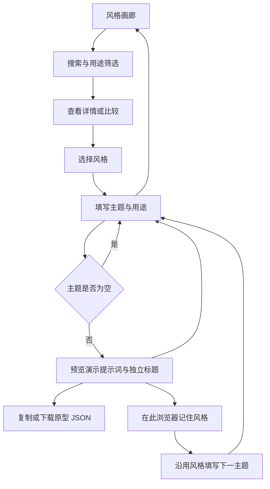

# 项目流程图

当前状态：READY_FOR_WIREFRAME，产品方向已确认，结构原型待验收。

最短验收路径：选择风格 → 填入示例 → 预览 → 复制 → 沿用风格。

原型用于验证找到风格、表达主题和复用选择是否顺畅。正式实现阶段再确定稳定数据契约、Skill/CLI 共用逻辑、真实样图与效果验证。MCP 不在本轮范围。

开源价值假设：用户希望省去重复描述画风的工作，并跨主题维持一致性。以实际导出和再次使用验证价值；不以点赞或访问量替代复用证据。开源首版不设付费。

传播假设：可复现的前后对比和实操教程吸引创作者；接收者打开画廊能找到同款风格并复现。需真实输出验证后再制作推广素材。发布前按选定平台核验现行规则，不承诺避免限流。
