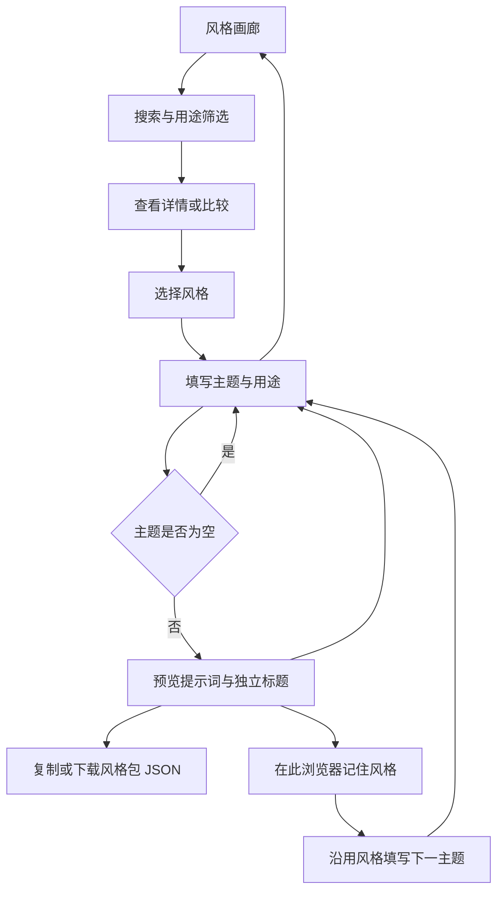

# 项目流程图

当前状态：本地 Alpha 可用，代码已公开；正式 Release 尚未发布。

最短验收路径：选择风格 → 填入示例 → 预览 → 复制 → 沿用风格。

画廊、CLI 与 Skill 已共用本地渲染器，四种风格有候选样图。718e17c 的远程 CI 已通过；新增纸雕完成两主题中文配方实测，用户接受 Alpha 视觉基线，尚未接入目标产品。下一阶段：提交并推送本地新增内容 → 核验新提交 CI → 整理 Alpha Release 与平台内容。MCP 仍不在首版范围。

开源价值假设：用户希望省去重复描述画风的工作，并跨主题维持一致性。以实际导出和再次使用验证价值；不以点赞或访问量替代复用证据。开源首版不设付费。

传播假设：可复现的前后对比和实操教程吸引创作者；接收者打开画廊能找到同款风格并复现。需真实输出验证后再制作推广素材。发布前按选定平台核验现行规则，不承诺避免限流。

## 静态网页版接入（2026-09-10）

本轮沿用已有流程实现纯浏览器渲染，静态包通过普通服务器验证；主站仅需发布 dist 内容，无渲染后端。构建、共享规则、验收证据和未完成项以 [静态交接文档](static-web.md) 为准。本轮未提交或部署。
